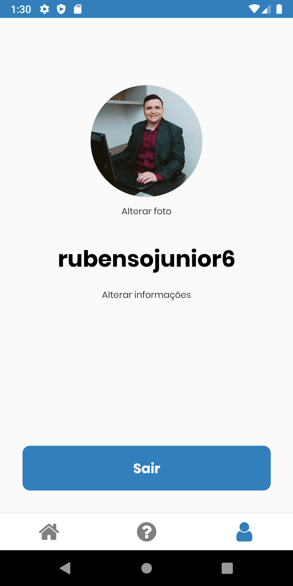
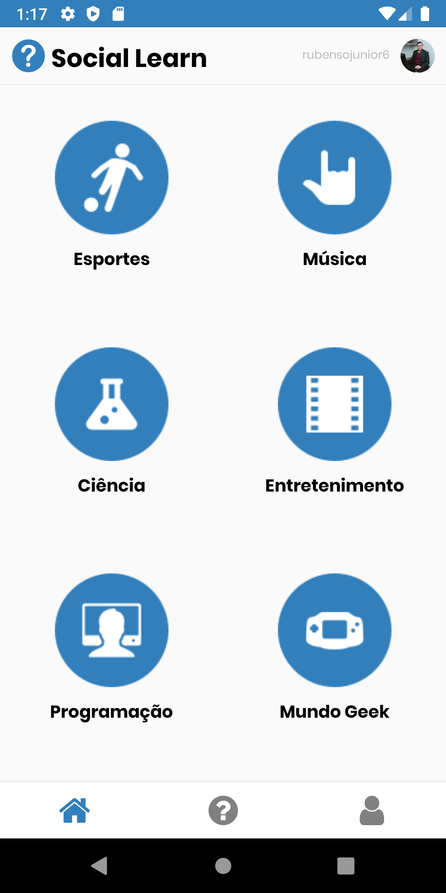
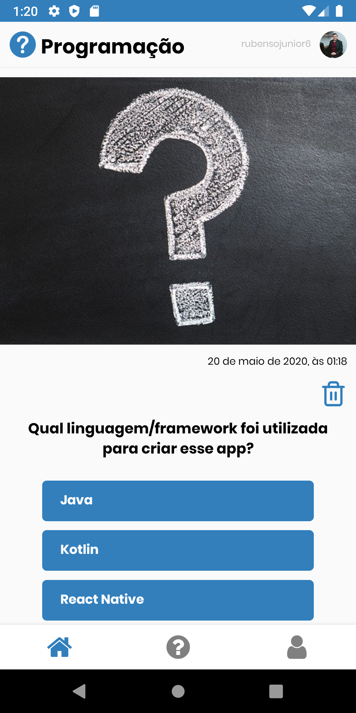
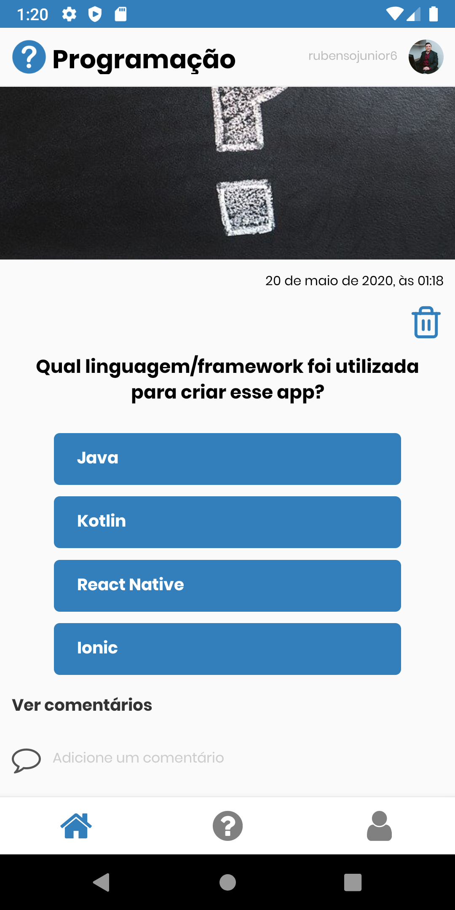
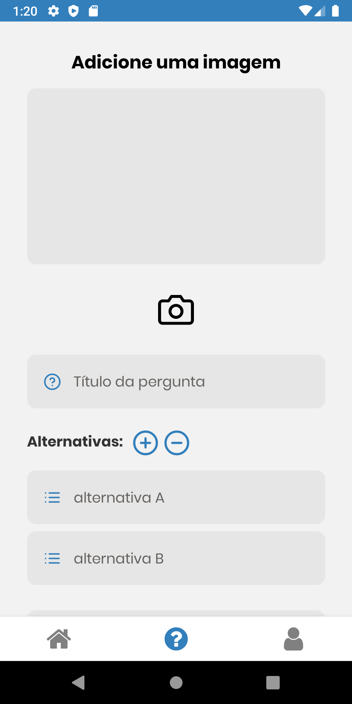
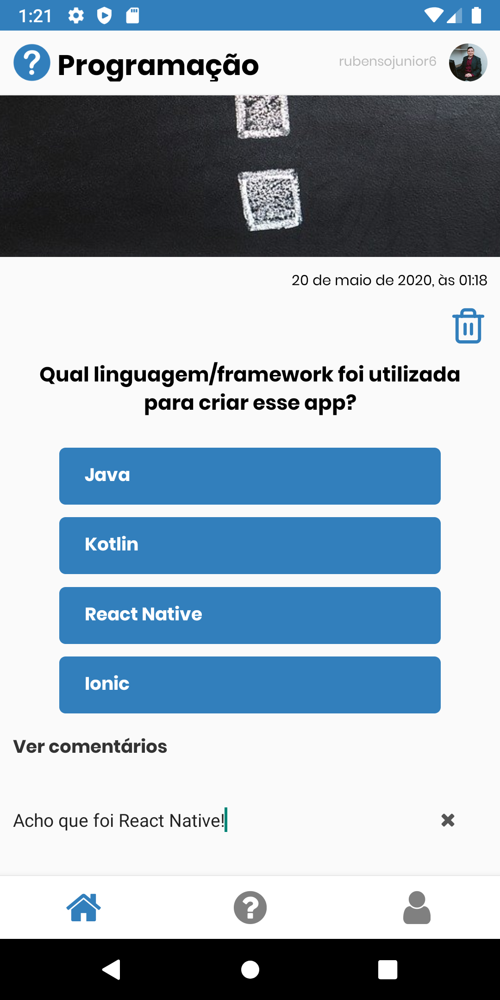

<h1 align="center">
 
Social Learn
</h1>

Social Learn is an android/ios application that I created to put my knowledge of React Native into practice. It is a question and answer application, in which moderators create questions and users answer them. In addition, the application has comments on the questions to create an interaction between users.

  

  
  
  
  
  
  
  

## Features

- Moderators can create a question.
- Moderators can delete a question.
- Moderators can delete any comment.

- User can create a account.
- User can recover pass.
- User can login.
- User can comment on a question if he is logged in.
- User can delete his comment.
- User can answer the question.
- User can see questions that he answered and if answered right or wrong.
- User can change photo.
- User can see other users profile.

- ⚛️ **React Native** — A lib that provides a way to create native apps for Android and iOS

## Getting started

- Clone project > enter the project folder
- Update src > env.example.js with correct values
- run `yarn`
- run `yarn android`

## License

This project is licensed under the MIT License - see the [LICENSE](https://opensource.org/licenses/MIT) page for details.

---

Created with passion by me 👨🏻‍💻
